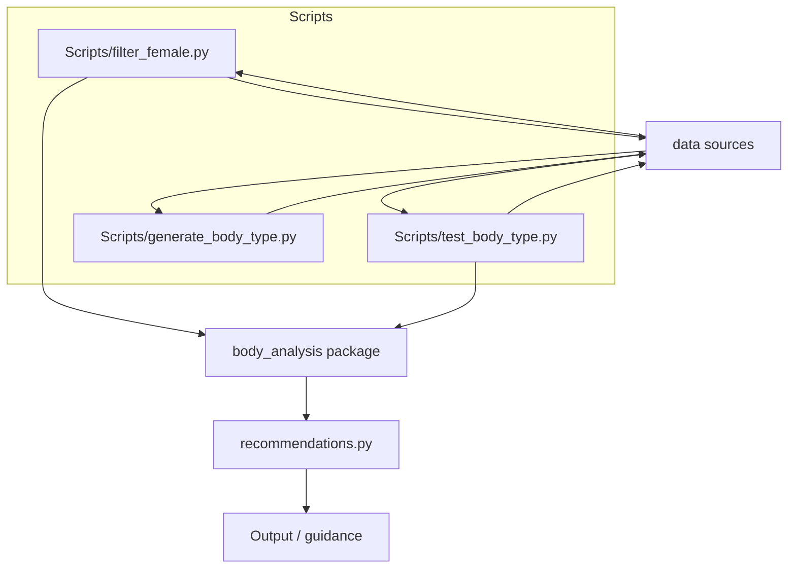

# AI Fashion Stylist

[](https://www.python.org/)
[](README.md)

AI Fashion Stylist is a Python toolkit for body shape classification, proportion analysis, and style recommendations. It combines rule-based body type detection with a recommendation engine and dataset workflows for fashion styling research.

## Table of Contents

- [Project Overview](#project-overview)
- [Key Features](#key-features)
- [Tech Stack](#tech-stack)
- [Architecture](#architecture)
  - [System Architecture](#system-architecture)
  - [Recommendation Flow](#recommendation-flow)
- [Project Structure](#project-structure)
- [Getting Started](#getting-started)
  - [Prerequisites](#prerequisites)
  - [Installation](#installation)
  - [Running the repository](#running-the-repository)
- [Usage](#usage)
  - [Body type classification](#body-type-classification)
  - [Style recommendations](#style-recommendations)
- [Data](#data)
- [Environment Variables](#environment-variables)
- [Scripts](#scripts)
- [Module Reference](#module-reference)
- [Troubleshooting](#troubleshooting)
- [FAQ](#faq)
- [Contributing](#contributing)
- [License](#license)
- [Acknowledgements](#acknowledgements)

## Project Overview

AI Fashion Stylist is a code-first repository for analyzing body measurements and generating styling guidance. It includes:

- rule-based body type classification for common silhouette categories
- body proportion analysis for legs, shoulders, torso, and arms
- a style recommendation engine tailored to body type
- script-based data workflows using local CSV data and Kaggle dataset integration

This repository is focused on backend logic and dataset processing rather than a deployed application or user interface.

## Key Features

- Body type classification for:
  - Pear
  - Hourglass
  - Rectangle
  - Inverted Triangle
  - Apple
- Proportions classification for:
  - leg length
  - shoulder width
  - torso length
  - arm length
- Style recommendation engine with `recommended` and `avoid` guidance
- Kaggle dataset integration through `kagglehub` for dataset validation
- Rule-based logic intended for research and styling prototype workflows

## Tech Stack

| Layer | Technology |
|---|---|
| Language | Python |
| Data processing | pandas |
| External dataset access | kagglehub |
| Standard library | `collections.abc`, `typing`, `os`, `sys`, `runpy` |

## Architecture

The repository is structured around a small Python package plus script workflows.

### System Architecture



### Recommendation Flow

```mermaid
flowchart TD
  Input[Input body profile]\n  -->|body_type| RecommendationEngine[recommendations.get_recommendations]\n  RecommendationEngine --> Outputs[recommended / avoid lists]
```

## Project Structure

```text
.
├── README.md                      # Project documentation
├── main.py                        # Placeholder application entrypoint
├── recommendations.py             # Style recommendation engine
├── run_tests.py                   # Runner for body type validation script
├── body_analysis/                 # Core body analysis utilities
│   ├── body_type.py               # Body type classification and styling characteristics
│   ├── bmi.py                     # Placeholder BMI module (currently empty)
│   └── proportions.py             # Proportion classification utilities
├── Scripts/                       # Analysis and dataset workflows
│   ├── filter_female.py           # Kaggle dataset female subset body type assignment
│   ├── generate_body_type.py      # Local CSV dataset loader / preview
│   └── test_body_type.py          # Kaggle-backed body type validation workflow
└── data/                          # Dataset artifacts
    ├── dataset.csv                # Local dataset used by Scripts/generate_body_type.py
    └── temp_kaggle_dataset/       # Cached Kaggle dataset artifacts and image data
```

## Getting Started

### Prerequisites

- Python 3.8 or later
- `pip` package manager
- Internet access for Kaggle dataset workflows (optional)

### Installation

1. Clone the repository:

```bash
git clone <repository-url>
cd AI Fashion Stylist
```

2. Install dependencies:

```bash
pip install pandas kagglehub
```

3. Confirm that the local dataset exists in `data/dataset.csv` if you plan to use `Scripts/generate_body_type.py`.

### Running the repository

Run the main validation script:

```bash
python run_tests.py
```

Run the Kaggle-backed test workflow directly:

```bash
python Scripts/test_body_type.py
```

Load the local dataset preview:

```bash
python Scripts/generate_body_type.py
```

Filter female body type predictions from Kaggle data:

```bash
python Scripts/filter_female.py
```

## Usage

### Body type classification

Use `body_analysis.body_type.determine_body_type(...)` to classify body shape.

```python
from body_analysis.body_type import determine_body_type

body_type = determine_body_type(
    shoulder=40,
    bust=90,
    waist=70,
    hip=100,
    verbose=True,
)
print(body_type)
```

When `verbose=True`, the function prints the body type characteristics and styling goal.

### Style recommendations

Use `recommendations.get_recommendations(...)` to retrieve styling guidance.

```python
from recommendations import get_recommendations

profile = {
    "body_type": "Pear",
    "leg_type": "Long Legs",
    "torso_type": "Balanced Torso",
    "shoulder_type": "Balanced Shoulders",
    "arm_type": "Balanced Arms",
}

recommendations = get_recommendations(profile)
print(recommendations)
```

The output format is:

```python
{
    "recommended": [...],
    "avoid": [...],
}
```

## Data

The repository contains two dataset workflows:

- `data/dataset.csv` — local dataset used by `Scripts/generate_body_type.py`
- Kaggle dataset workflow in `Scripts/test_body_type.py` and `Scripts/filter_female.py` using the handle:
  - `zara2099/personalized-clothing-and-body-measurements-data`
  - file: `personalized_clothing_dataset.csv`

The `data/temp_kaggle_dataset/` folder contains cached dataset artifacts and image data from the Kaggle dataset.

## Environment Variables

The repository does not include a `.env` file or `.env.example`.

If you use Kaggle dataset workflows, you should configure Kaggle credentials externally according to `kagglehub` requirements.

Example placeholder values:

```env
KAGGLE_USERNAME=your_kaggle_username
KAGGLE_KEY=your_kaggle_api_key
```

## Scripts

| Script | Purpose |
|---|---|
| `run_tests.py` | Runs `Scripts/test_body_type.py` as a validation workflow |
| `Scripts/test_body_type.py` | Loads Kaggle data and validates body type predictions |
| `Scripts/filter_female.py` | Filters Kaggle dataset for female rows and computes body types |
| `Scripts/generate_body_type.py` | Reads `data/dataset.csv` and prints dataset columns |

## Module Reference

### `body_analysis/body_type.py`

- `determine_body_type(shoulder, bust, waist, hip, verbose=False)`
- `get_body_type_characteristics(body_type)`
- `print_body_type_characteristics(body_type)`

This module provides body type classification using rule-based measurements and prints styling characteristics for each recognized shape.

### `body_analysis/proportions.py`

- `classify_leg_length(leg_length, height)`
- `classify_shoulders(shoulder_width, height=None)`
- `classify_torso(leg_length, height)`
- `classify_arm_length(arm_length, height)`

The proportion utilities return classification dictionaries for legs, shoulders, torso, and arms.

### `recommendations.py`

- `get_recommendations(body_profile)`

The recommendation engine accepts either a string body type or a mapping with at least a `body_type` key. It returns a dictionary with styling guidance for `recommended` and `avoid` categories.

## Troubleshooting

- `ModuleNotFoundError`: install missing packages with `pip install pandas kagglehub`.
- `kagglehub` dataset access fails: ensure Kaggle CLI or credentials are configured externally.
- `data/dataset.csv` missing: verify the file exists before running `Scripts/generate_body_type.py`.
- Invalid measurement values: the body analysis utilities validate numeric dimensions and may raise `ValueError` for negative or zero measurements.

## FAQ

<details>
<summary>Is there a web application or API in this repository?</summary>

No. This repository contains backend Python scripts and data workflows only. There is no HTTP API, web routing, or UI layer present in the codebase.

</details>

<details>
<summary>Does this repository include a database schema?</summary>

No. There is no relational database or schema file in the current repository.

</details>

<details>
<summary>Is there a license?</summary>

No LICENSE file was detected in the repository. Add a license file to define usage terms.

</details>

## Contributing

No `CONTRIBUTING.md` file is present in the repository. If you want to contribute:

1. Open an issue for feature requests or bug reports.
2. Submit a pull request with a clear description of your changes.
3. Keep the scope focused on body analysis, recommendations, or dataset workflows.

## License

No license is specified in this repository. Add a license file such as `LICENSE` to clarify the project terms.

## Acknowledgements

- pandas for data loading and table handling
- kagglehub for Kaggle dataset access
- Rule-based body typing and styling guidance patterns derived from project code
